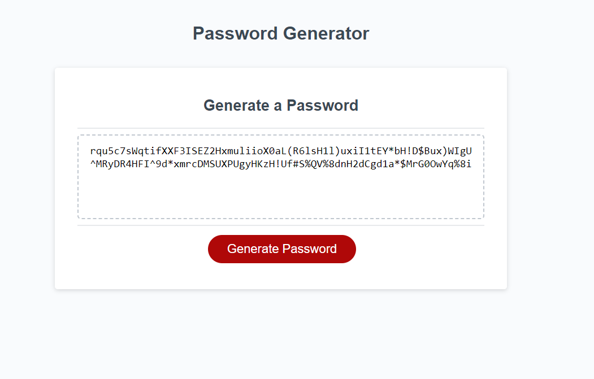

# Password Generator       

## Description

It generates passwords using javascript code taking user inputs from a front-end website. All executed locally. Returns a password with a length of 8-128 characters that includes any combination of lowercase/uppercase/numbers/special characters based on if the user checked that box.

## Installation

Everything runs locally in a web browser deployed at github pages.

## Deployed App: [Github Pages](https://laurenwollaston.github.io/Module-03/)

## Demo

## Contribution Guidelines

This is a finished challenge, no further contribution is needed.

## Testing Instructions

Go to the deployed app on github pages linked below and follow the instructions to generate a password.

## License

CC0

## Questions

[Github](https://github.com/LaurenWollaston)
[E-Mail](mailto:Laurenofw@gmail.com)
